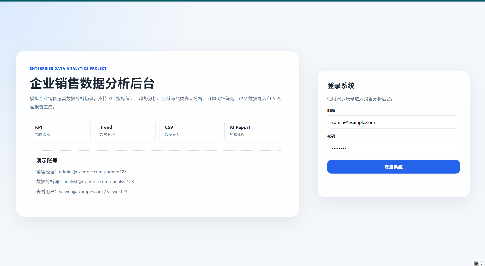
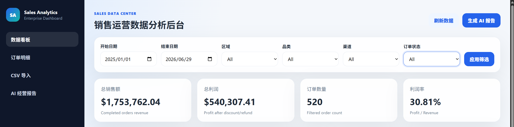
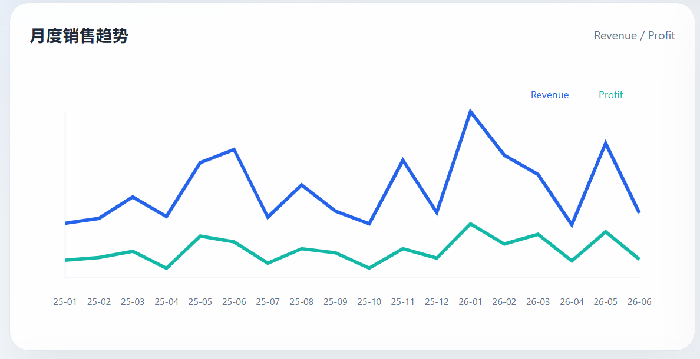
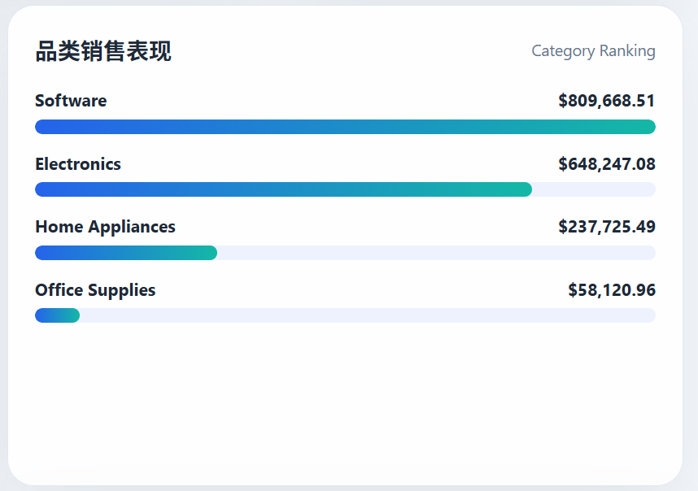
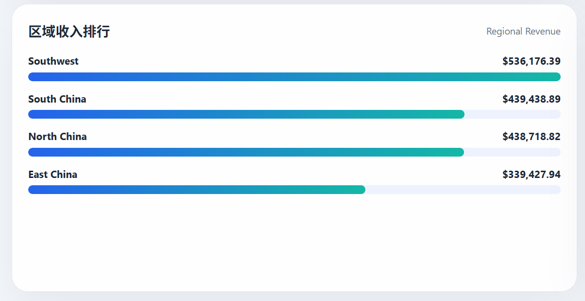
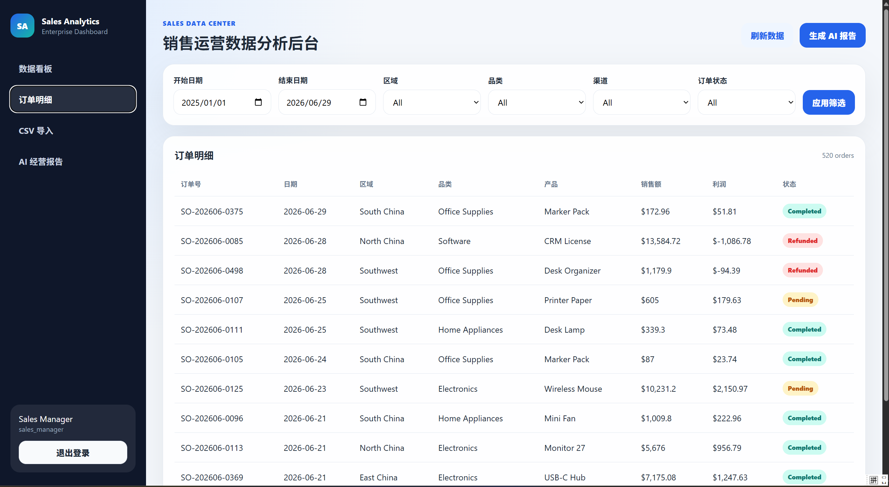
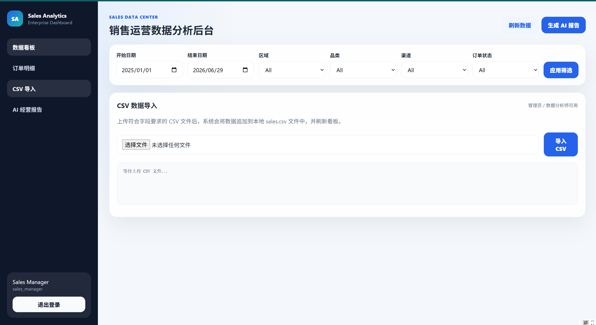
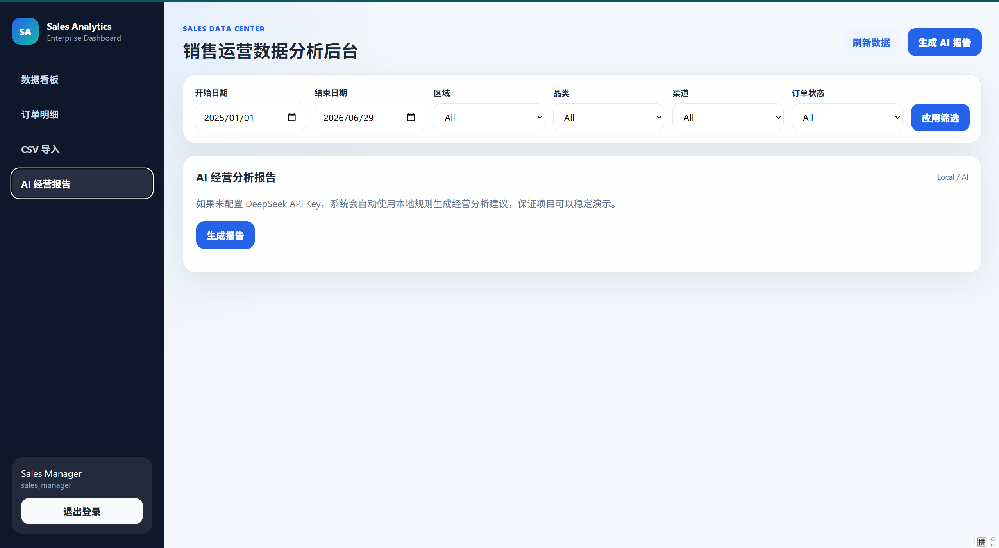

# Sales Analytics Dashboard 企业销售数据分析后台

## 项目简介

Sales Analytics Dashboard 是一个模拟企业销售运营场景的数据分析后台项目。系统基于 Node.js、Express 和原生 JavaScript 开发，使用 CSV 文件作为演示数据源，实现销售 KPI 指标统计、月度趋势分析、区域销售排行、品类销售表现、订单明细筛选、CSV 数据导入和 AI 经营报告生成等功能。

该项目定位为企业业务场景模拟项目，重点展示数据分析后台的业务理解、接口设计、数据处理、指标统计、可视化展示和 AI 辅助分析能力，适合作为软件工程、信息技术管理、数据分析和 AI 应用方向的作品集项目。

## 项目截图

### 登录页面


### 销售数据看板


### 月度销售趋势


### 品类销售排行


### 区域销售排行


### 订单明细表


### CSV 数据导入


### AI 经营分析报告


## 技术栈

前端：HTML、CSS、JavaScript

后端：Node.js、Express

数据源：CSV 文件

数据处理：Node.js 文件读取、筛选、聚合统计

可视化：原生 SVG / CSS 图表

AI 辅助：DeepSeek API 可选；未配置 Key 时使用本地规则生成分析报告

项目管理：npm、Git、GitHub

## 核心功能

用户登录与角色区分

销售 KPI 指标统计：销售额、利润、订单数、利润率

按日期、区域、品类、渠道、状态筛选数据

月度销售趋势图

品类销售表现排行

区域销售收入排行

订单明细表格展示

CSV 销售数据导入

数据质量检查：重复订单、缺失字段、订单状态统计

AI 经营分析报告生成

## 运行方式

### 1. 安装环境

先安装 Node.js。

### 2. 安装依赖

进入项目目录后运行：

```bash
npm install
```

### 3. 启动项目

```bash
npm start
```

默认访问地址：

```text
http://localhost:3001
```

如果 3001 端口被占用，可以在 `.env` 文件中修改：

```env
PORT=3002
```

## 演示账号

销售经理：admin@example.com / admin123

数据分析师：analyst@example.com / analyst123

查看用户：viewer@example.com / viewer123

## CSV 数据字段

系统演示数据位于：

```text
data/sales.csv
```

必需字段包括：

```text
order_id,date,region,city,category,product,customer_type,sales_amount,quantity,discount,profit,channel,status
```

## AI 报告说明

如果不配置 API Key，系统会使用本地规则生成经营分析报告，保证项目可以稳定运行。

如果需要接入 DeepSeek API，可以复制 `.env.example` 为 `.env`，然后填写：

```env
DEEPSEEK_API_KEY=你的API密钥
```

## 项目亮点

该项目不是简单的静态图表页面，而是围绕企业销售运营场景设计的数据分析后台。系统包含数据读取、筛选、聚合统计、图表展示、订单明细、CSV 导入、数据质量检查和 AI 报告生成等功能，能够体现从业务需求到数据分析系统实现的完整流程。


